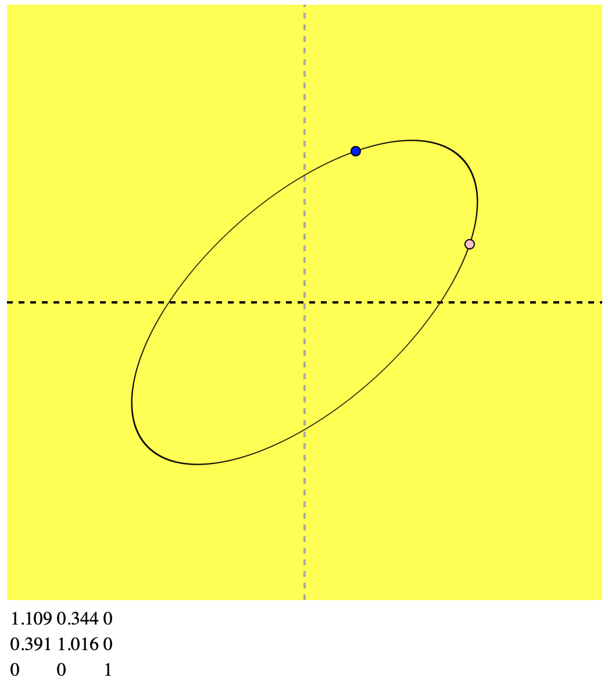

Conjugate Diameters are a feature of conic sections. Each of the pair of conjugate daiamters bisects all the chords parallel to the other.

You can also use it to control the shape of the curve!

Here is a simple HTML + SVG example to show this trick.

